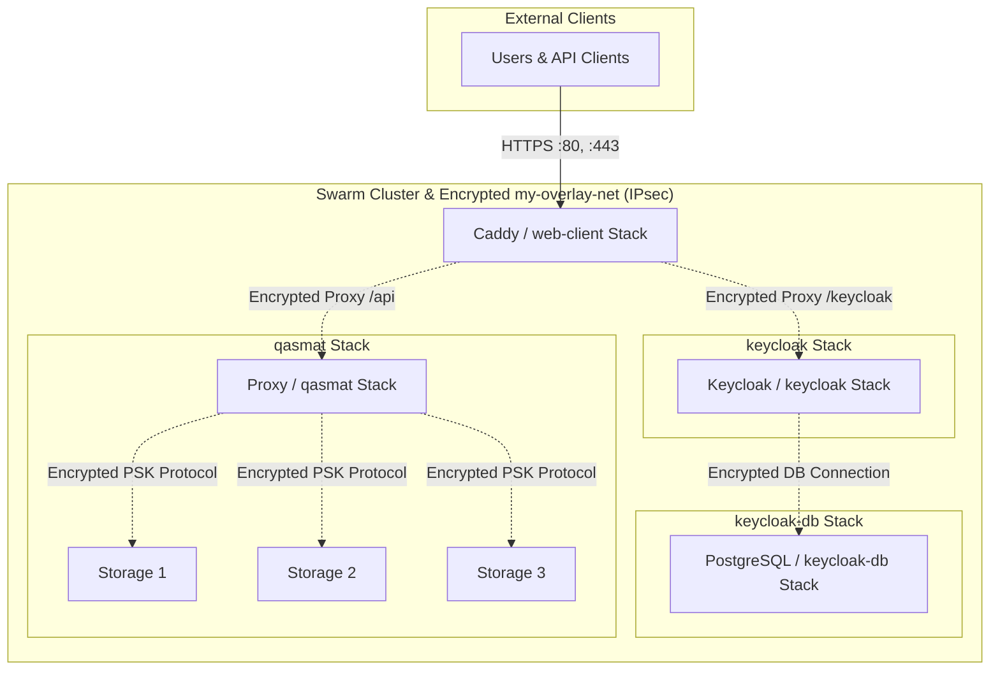
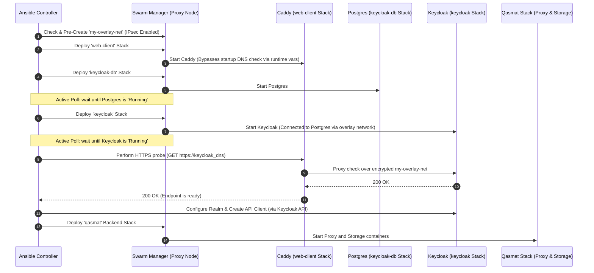

# Progress Summary: Swarm Deployment Architecture Refactoring

This document outlines the final, highly consolidated and simplified architecture implemented to split the Docker Swarm deployment, secure the overlay network, and elevate Keycloak to a production-grade setup.

## Key Changes Implemented

### 1. Unified `keycloak` Role (Infrastructure + Configuration)
With write access enabled, the infrastructure deployment tasks and configuration tasks have been fully merged into the official **`keycloak`** role (`roles/keycloak/`). 
* **Templates Location**: The templates `docker-compose-db.yml.j2` and `docker-compose-keycloak.yml.j2` are stored under `roles/keycloak/templates/`.
* **Integrated Tasks**: All directories are set up locally on the Keycloak host, while Swarm-level commands (templating, copying, deploying, and polling the database and Keycloak stacks) are executed via Ansible delegation (`delegate_to: "{{ groups['proxy'][0] }}"`) to the Swarm manager.

### 2. Decoupled Web-Client Ingress Stack
To resolve the circular bootstrap dependency between Caddy and Keycloak (where Keycloak requires Caddy for external HTTPS setup, but Caddy originally required Keycloak to be resolvable/running before starting up), the **`web-client`** (Caddy) service was fully extracted from `docker_swarm_deploy` into its own dedicated role **`web_client_deploy`**.
* **Dynamic Upstreams**: The Caddy proxy configuration (`Caddyfile.j2`) has been updated to use dynamic runtime upstream resolution via placeholder variables (`vars` directive) for both Keycloak and the Qasmat API proxy. This ensures Caddy boots up successfully and obtains certificates without crashing, even before those backend services exist in DNS.
* **Separated Web-Client Stack**: The Caddy service is deployed first as a separate `web-client` stack, functioning as a global ingress router.

### 3. Sequential Four-Stack Deployment Strategy
In Docker Swarm, the `depends_on` setting is ignored. To enforce correct startup orders, secure SSL certificate checks, and reliable dependency management, we have orchestrated the deployment sequence into four independent, sequential Swarm stacks:
1. **`web-client` Stack**: Deploys the Caddy gateway (`web_client_deploy` role) to handle HTTPS certificates and routing.
2. **`keycloak-db` Stack**: Deploys the persistent PostgreSQL 16 database service (`keycloak-db_keycloak-db`) with a native health check (`pg_isready`).
3. **`keycloak` Stack**: Deploys Keycloak (`keycloak_keycloak`), referencing the database across stacks via service discovery (`keycloak-db_keycloak-db`). It immediately performs the external HTTPS status checks and OIDC realm/client setup through Caddy.
4. **`qasmat` Stack**: Deploys the main application backend components (`proxy` and `storage` nodes).

### 4. Active Status Polling in Ansible
To guarantee proper execution order:
* The unified `keycloak` tasks deploy the stacks sequentially on the Swarm master.
* After deploying `keycloak-db`, the playbook uses `docker service ps` to actively poll the status until the database service is fully `Running` across the cluster before launching Keycloak.
* After deploying `keycloak`, the playbook similarly polls and waits for Keycloak to be `Running` before proceeding with Keycloak REST API calls.

### 5. Encrypted Overlay Network Configuration
* **Idempotent Network Pre-creation**: Both `web_client_deploy` and `docker_swarm_deploy` tasks include an idempotent check to verify and pre-create the shared `my-overlay-net` overlay network.
* **IPsec Network Encryption**: Updated the network creation task to include the `--opt encrypted` flag, enabling secure, encrypted IPsec communication for all container-to-container traffic in the Swarm:
  ```bash
  docker network create --driver=overlay --attachable --opt encrypted my-overlay-net
  ```
* **External Network Reference**: All four stacks (`web-client`, `keycloak-db`, `keycloak`, and `qasmat`) reference `my-overlay-net` as an external network, ensuring secure, cross-stack communication.

### 6. Clean Stack Removal Cleanup
The stack removal role (`roles/docker_swarm_remove/tasks/main.yaml`) has been updated to cleanly tear down and remove all four deployed stacks:
```yaml
- name: Remove the Docker Swarm stacks using command
  ansible.builtin.command: >
    docker stack rm qasmat web-client keycloak keycloak-db
  failed_when: false
```

## Architecture Diagrams & Workflows

### 1. Network & Stack Architecture Diagram
The diagram below illustrates how external clients access the cluster services via Caddy (ingress) and how all container-to-container communication is securely isolated and encrypted over the shared IPsec overlay network (`my-overlay-net`).



### 2. Orchestrated Deployment Workflow
This sequence diagram shows how the dynamic upstream configuration allows Caddy to start first without crashing, resolving the circular dependency so that Keycloak can be safely deployed and configured next, and the backend stack last.



---
*All playbooks and role configurations have been syntactically verified with `ansible-playbook --syntax-check` and are fully validated and ready for deployment!*
